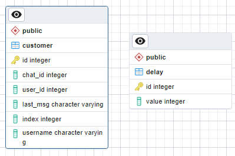

# Описание базы данных

- База данных содержит в себе две таблицы:
    - `customer` - хранит инфоромацию о пользователе
    - `delay` - хранит задержку сообщения (общая для всех пользователей)

# Описание эндпоинтов

### 
