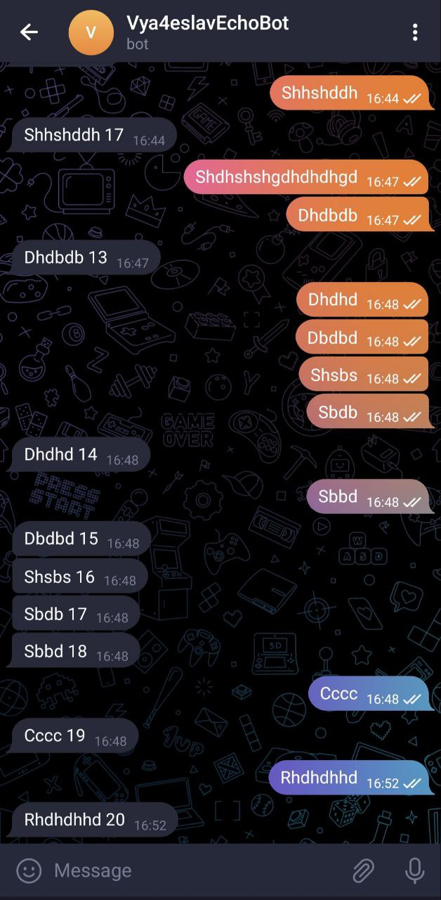

# Задание

***Доступные языки программирования:*** Java, Kotlin

***Доступные фреймворки и библиотеки:***
- Для создания веб интерфейса разрешается использование любых библиотек и
фреймворки, но преимуществом будет использование Ktor, Spring
- Для отсыла сетевых запросов разрешается использование любых библиотек (К
примеру таких как Retrofit / Ktor client)
- Можно использовать любое хранилище данных, однако приветствуется
использование in-memory решений. В случае если используется не in-memory
решение, надо обеспечить атомарность запросов к БД
- В качестве ORM можно использовать любую библиотеку по желанию

***Описание задачи:***
- В качестве задачи вам предлагается реализовать эхо
телеграм-бота с веб интерфейсом. Веб интерфейс представляет из себя простое api
для управления настройками и получения статистики из работающего телеграм бота.

***Функциональность:***

- Многопользовательская поддержка (иначе говоря, этим ботом должны иметь
возможность пользоваться одновременно несколько телеграмм пользователей)
- Echo вывод данных с количеством сообщений через фиксированный интервал
*Echo вывод данных – вывод введенного пользователем сообщения (к примеру,
пользователь вводит «привет» = бот выводит «привет 1», пользователь вводит
«как дела?» = бот выводит «как дела? 2», пользователь вводит «пока» = бот
выводит «пока 3»)
- Echo сообщения должны поступать в единую очередь запросов и
обрабатываться по мере возможностей системы
- Бот должен запоминать количество введенных сообщений пользователем
- Бот должен иметь возможность изменять задержку вывода сообщений через
веб-интерфейс (см. схему работы)
- Требуемые для запуска бота параметры не должны быть захардкожены
- Допускается подстановка параметров через
  - Cтартовые аргументы 
  - Из .env файла 
  - Из docker-compose
- Будет супер увидеть запуск из собранного jar / docker образа

***Cхема работы:***
1) При запуске бота пользователь вводит команду /start. В этот момент сервис должен
   начинать отслеживать количество его сообщений.
2) Весь дальнейший ввод информации, после начала использования бота и
   сохранения пользователя, считается как echo message.
3) При вводе эхо сообщения, на стороне сервера оно поступает в очередь обработки
4) Когда обработчик сообщений имеет ресурсы, он берёт 'Job' в обработку.
   Осуществляет задержку и отправляет сообщение с индексом
6) В любой момент на веб-интерфейс может прилететь изменение delay для echo
   сообщений

***Дополнительные комментари:***

- Если будет нетрудно, в репозитории с тестовым хотелось бы видеть небольшой
файл с коротким описанием решения и набором curl скриптов для тестирования
API.
- Тестовое, разумеется, должно быть загружено в виде готовом для запуска и
тестирования
- Интересные решения выходящие за рамки требований – приветствуются и
будут оценены по достоинству. К примеру, если хочется запилить OpenAPI
вместо curl скриптов, то это будет плюсом :)

# Стек

Использовались следующие технологии:

- Java 11
- Spring Boot
- Spring Data
- Swagger 3
- Junit 5
- Mockito
- Docker
- PostgreSQL
- ActiveMQ

# Описание базы данных


- База данных содержит в себе две таблицы:
    - `customer` - хранит инфоромацию о пользователе
    - `delay` - хранит задержку сообщения (общая для всех пользователей)

# Описание эндпоинтов

### http://localhost:8083/delay/{value}

- Изменение задержки

### http://localhost:8083/customer/init

- Добаввление пользователя

- Body:

```json
{
  "chatId": 1,
  "userId": 1,
  "lastMessage": "test",
  "index": 1,
  "username": "test2"
}
```

### http://localhost:8083/customer/index

- Обновление индекса

- Body:

```json
{
  "chatId": 1,
  "message": "qwerty",
  "userId": 1,
  "username": "qwerty"
}
```

### http://localhost:8083/customer/last/{id}

- Получение последнего сообщения пользователя

- Response:

```json
{
  "username": 1,
  "message": "qwerty"
}
```

### http://localhost:8083/customer/exist/{id}

- Проверка, существует ли пользователь. Возвращается true/false 

### Swagger

- для запуска Swagger необходимо воспользоваться url:

```
http://localhost:8083/swagger-ui/index.html#/
```

# Как запустить?

- Предварительно мной был создан образ приложения и добавлен на [DockerHub](https://hub.docker.com/u/vya4eslava):

- Для запуска Вам необходимо клонировать на свой компьютер репозиторий. Либо скачать .zip архив с проектом

- Установить в `docker-compose` токен и название бота:

```yaml
BOT_NAME:
BOT_TOKEN:
```

- При желании можно изменить задержку:

```yaml
DELAY_VALUE: 2000
```

- После этого выполнить команду:

```shell script
docker compose up -d
```

# Результаты


